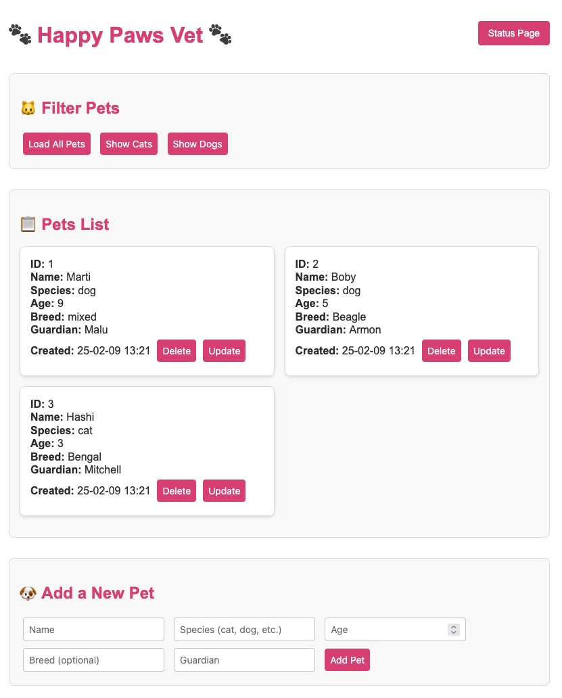

# consul-simple-app

CRUD application



## Container image sources in Docker Hub ATM

 * Build images for amd64 arch

```sh
> cd api
> docker build --platform linux/amd64 . -t mauriciomem/simple-consul-app-api:0.1

> cd frontend
> docker build --platform linux/amd64 . -t mauriciomem/simple-consul-app-frontend:0.1
```

 * Push images to Docker HUB
 
```sh
> docker push mauriciomem/simple-consul-app-frontend:0.1
> docker push mauriciomem/simple-consul-app-api:0.1
```

## API Endpoints

|Route|Description|Method|
|-|-|-|
| 🟩 /pets | Get all pets | GET |
| 🟩 /pets | Add pet | POST |
| 🟩 /pets/dogs | Get dogs | GET |
| 🟩 /pets/cats | Get cats | GET |
| 🟩 /pets/{pet_id} | Update pet | PUT |
| 🟩 /pets/{pet_id} | Delete pet | DELETE |
| 🟩 /health | Get API status | GET |